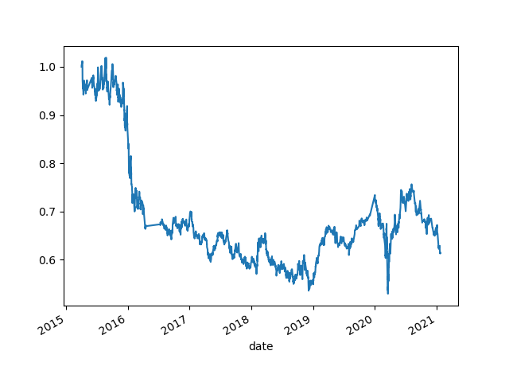
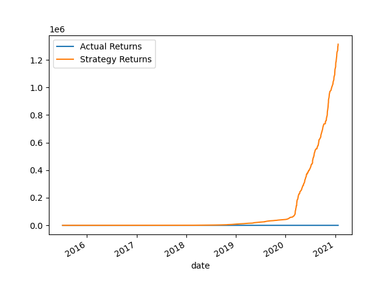
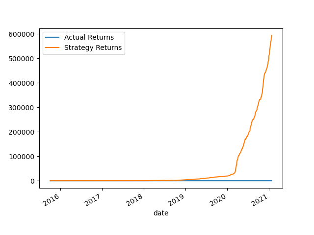
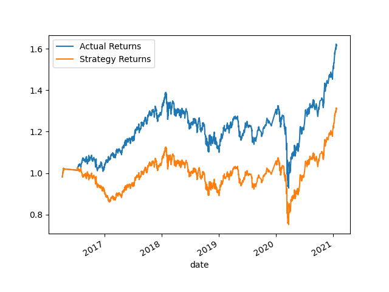
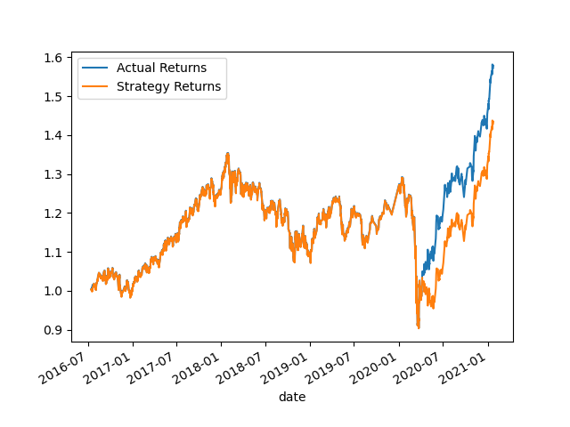

# Challange 14

## Conclusions

<figure>
    <figcaption>Simple Moving Average Model</figcaption>
     
</figure>

<figure>
    <figcaption>SVM Model</figcaption>
     
</figure>

<figure>
    <figcaption>SVM Training Adjusted Model</figcaption>
     
</figure>

<figure>
    <figcaption>SVM SMA Adjusted Model</figcaption>
     
</figure>

<figure>
    <figcaption>Linear Regression Model</figcaption>
     
</figure>

-  What impact resulted from increasing or decreasing the training window?
-  SVM Training Adjusted Model generally performs slightly better than SVM Model.
-  Both models have higher precision for class 1.0 compared to class -1.0.
-  SVM Training Adjusted Model has a higher recall for class -1.0 but lower precision, resulting in a lower F1-score for class -1.0.
-  SVM Training Adjusted Model has higher macro and weighted averages for precision, recall, and F1-score.
-
-  
-  What impact resulted from increasing or decreasing either or both of the SMA windows?
-  short_window = 25
-  long_window = 200
-  Training window = 6 months
-  The baseline model seems to have better performance for the 1.0 class, with a higher precision and recall, resulting in a higher F1-Score for that
-  class. However, it has a very low performance for the -1.0 class,    -  with a precision, recall, and F1-Score all close to zero.
-  SVM Training & SMA Adjusted Model, on the other hand, has better performance for the -1.0 class in terms of precision, recall, and F1-Score, but it
-  sacrifices precision for the 1.0 class.
-  If achieving better performance for the -1.0 class is crucial, you might lean towards the second set of metrics. 
-
-  
-  Did this new model perform better or worse than the provided baseline model? 
-  Both sets of metrics are quite similar, with the Linear Regression Model having a slightly lower precision for the -1.0 class and a slightly higher ----  recall for the -1.0 class. The overall accuracy, macro-avg, and
-  Weighted-avg metrics are also similar between the two sets.
-  If precision for the -1.0 class is more important, you might lean towards the baseline model.
-  If you prioritize the recall for the -1.0 class, Linear Regression Model might be considered slightly better. 
-
-
-  Did this new model perform better or worse than your tuned trading algorithm?
-  Both sets of metrics are quite similar, with the Linear Regression Model having a slightly lower recall for the -1.0 class and a slightly higher F1
-  Score for the -1.0 class.
-  The overall accuracy, macro-avg, and weighted-avg metrics are also similar between the two sets.
-  The choice between these two models would depend on the specific goals and requirements of your classification task.
-  If recall for the -1.0 class is crucial, the tuned trading algorithm might be considered.
-  If overall balance and a slightly higher F1-Score for the -1.0 class are more important, Linear Regression Model might be preferred. 

For more details, refer to the [full report](./machine_learning_trading_bot.ipynb).
