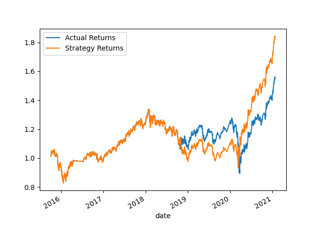

# Challange 14

## Conclusions

<figure>
    <figcaption>Simple Moving Average Model</figcaption>
     
</figure>

<figure>
    <figcaption>SVM Model</figcaption>
     
</figure>

<figure>
    <figcaption>SVM Training Adjusted Model</figcaption>
     
</figure>

<figure>
    <figcaption>SVM SMA Adjusted Model</figcaption>
     
</figure>

<figure>
    <figcaption>Linear Regression Model</figcaption>
     
</figure>

-  What impact resulted from increasing or decreasing the training window?
-  SVM Training Adjusted Model generally performs slightly better than SVM Model.
-  Both models have higher precision for class 1.0 compared to class -1.0.
-  SVM Training Adjusted Model has a higher recall for class -1.0 but lower precision, resulting in a lower F1-score for class -1.0.
-  SVM Training Adjusted Model has higher macro and weighted averages for precision, recall, and F1-score.
-
-  
-  What impact resulted from increasing or decreasing either or both of the SMA windows?
-  Both models have similar accuracy, macro averages, and weighted averages.
-  SVM SMA Adjusted Model has higher recall for class 1.0, while SVM Training Adjusted Model has higher recall for class -1.0.
-  SVM Training Adjusted Model has higher precision, recall, and F1-score for class -1.0 compared to SVM SMA Adjusted Model.
-  SVM SMA Adjusted Model has higher precision, recall, and F1-score for class 1.0 compared to SVM Training Adjusted Model.
-
-  
-  Did this new model perform better or worse than the provided baseline model? Did this new model perform better or worse than your tuned    -  trading algorithm?
-  Linear Regression Model has slightly lower precision for class -1.0 but similar recall and F1-score for class 1.0 compared to SVM SMA      -  Adjusted Model.
-  Linear Regression Model has a slightly higher accuracy, macro average precision, and macro average F1-score, while SVM SMA Adjusted Model  -  has a slightly higher macro average recall.
-
-
-  Both models have similar accuracy, macro averages, and weighted averages.
-  Linear Regression Model has lower precision for class -1.0 compared to SVM Model, but similar recall and F1-score for class -1.0.
-  Linear Regression Model has similar precision, recall, and F1-score for class 1.0 compared to SVM Model.
-  The choice between these models may depend on specific goals and requirements, as the differences in performance metrics are relatively    -  small.

For more details, refer to the [full report](./machine_learning_trading_bot.ipynb).
